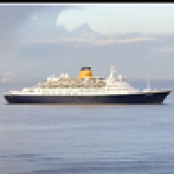
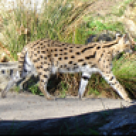
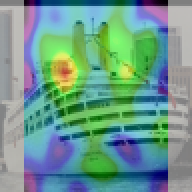
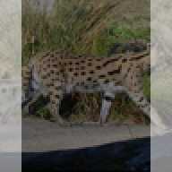
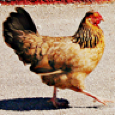
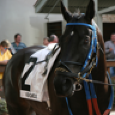
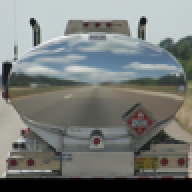
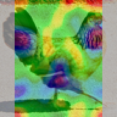
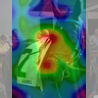

# Grad-Cam Pytorch

## Deepest Season 5 Recruiting: Quest 1 Source code

[Quest Link (PDF)](https://drive.google.com/file/d/14nG3DwQIBcWFgD9YmOKYa__8HEYOZMK7/view?fbclid=IwAR2PuLwA6bDNPDEHC5ZZaz3Tv448zjUbo0U156C_iLQVlHIgb_oaIiLDGEQ)

## Install

- python 3.6.x or higher
- pytorch v1.0.0 (It might run well on v0.4.x, but I did not test yet.)
- pillow
- numpy
- matplotlib (pyplot)

## Run

### Train Model

```
python train.py
```

### Evaluate Test Accuracy

```
python test.py
```

### Make Saliency Map Use Gradcam

```
python gradcam.py
```

## Results

- Test accuracy: 80.38%
- \# of parameters: 2,940,682

<table>
  <tr><th colspan=4>Correct Examples</th></tr>
  <tr>
    <th>Original <br/>Image</th>
    <td></td>
    <td></td>
    <td></td>
  </tr>
  <tr>
    <th>Saliency <br/>Map</th>
    <td></td>
    <td></td>
    <td></td>
  </tr>
</table>

<table>
  <tr><th colspan=4>Incorrect Examples</th></tr>
  <tr>
    <th>Original <br/>Image</th>
    <td></td>
    <td></td>
    <td></td>
  </tr>
  <tr>
    <th>Saliency <br/>Map</th>
    <td></td>
    <td></td>
    <td></td>
  </tr>
</table>
